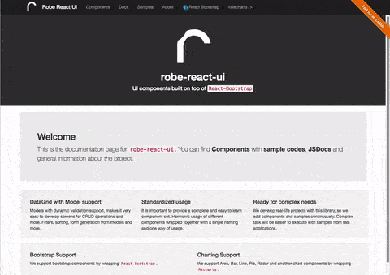

# Robe-React-UI
#### UI library built on top of <code>React-Bootstrap</code>
[](https://nodei.co/npm/robe-react-ui/)

[](https://badge.fury.io/js/robe-react-ui)
[](https://travis-ci.org/robeio/robe-react-ui)
[](https://codecov.io/gh/robeio/robe-react-ui)
[](https://www.versioneye.com/user/projects/58232e6e73023b003f2875af)

#### Browsers support (will be updated)
| </br>IE / Edge | </br>Firefox | </br>Chrome | </br>Safari | </br>Opera |
| :---------: | :---------: | :---------: | :---------: | :---------: |
| 11+ | 15+| 20+ | 5.1+ | 25+ |

**Note:** You need include [es5-shim](https://github.com/es-shims/es5-shim) and [es6-shim](https://github.com/paulmillr/es6-shim).

 ## [CHANGE LOG](./CHANGELOG.md)
 
 ## [CONTRIBUTION](./CONTRIBUTION.md)

 ## [ISSUE TEMPLATE](./ISSUE_TEMPLATE.md)

 Please take a look at [Project Site](http://robeio.github.io/robe-react-ui/)

RRU = Robe-React-UI

##### Motivation

UI components built on top of [React-Bootstrap](https://react-bootstrap.github.io/).

##### What's inside
* [Webpack](https://webpack.github.io/) for all development (server,hotload etc.) and build (package, optimize, etc.) needs.
* [Babel](https://babeljs.io/) for writing codes with ES6 syntax and transpiling them browser compatible codes. 
* [ESLint](http://eslint.org/) for protecting our nice formatted codes.
* [Karma](https://karma-runner.github.io/0.13/index.html) for testing.
* [React](https://facebook.github.io/react/) for ui.
* [React-Bootstrap](https://react-bootstrap.github.io/) for ui components
* [Recaptcha](https://github.com/appleboy/react-recaptcha) for ui reCAPTCHA component
* [GoogleMap](https://github.com/istarkov/google-map-react) for ui GoogleMap component
* [Enzyme](https://github.com/airbnb/enzyme) for ui testing
* [Open-Color]

### Documentation
 You can find detailed documentation at [robeio.github.io/robe-react-ui](http://robeio.github.io/robe-react-ui/)
 
 Site will include Component Showcase, JSDocs and more...


### Quick Start

#### 1. Get the latest version
You can start by cloning the latest version of RRU.

#### 2. Run `npm install`
This will install both run-time project dependencies and developer tools listed
in [package.json](./package.json) file.

#### 3. How to start project in Development Mode

This will start the development server and serve site application.

```shell
$ npm start
```
  
Open Browser and enter `http://localhost:8080` (default) 

### How to Build for Production

If you need just to build the app (without running a dev server), simply run:

```shell
$ npm run-script build
```
 
#####  How to run Unit Tests.

* Single Test Run with coverage for production.

```shell
$ npm test              # Run unit tests with Mocha
```

* Multi Test Run without coverage for development. 


```shell
$ npm run testd         # Run unit tests with Mocha
```

* Development Test Examples 


```ssh
    npm run testd Wizard
```
```ssh
    npm run testd ./__test__/wizard/Wizard.spec.js
```
```ssh
    npm run testd __test__/wizard/Wizard.spec.js
```
```ssh
    npm run testd /Users/kamilbukum/DEV/robe/robe-react-ui/__test__/wizard/Wizard.spec.js
```


